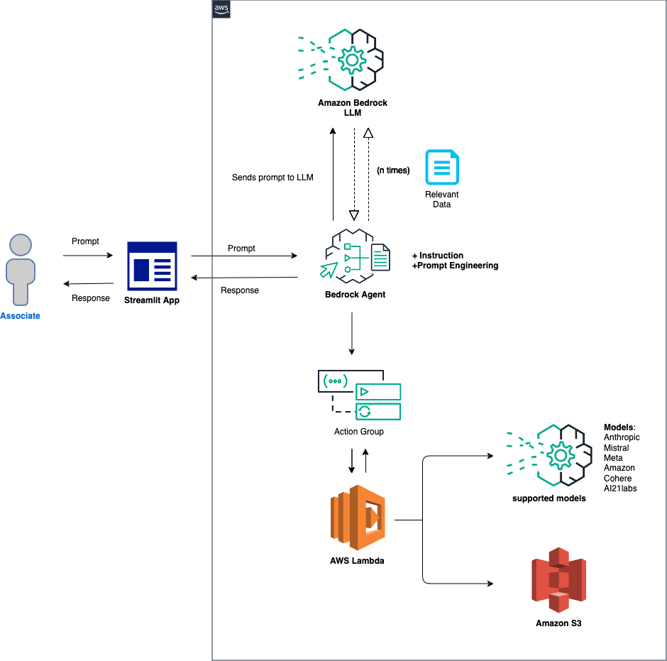
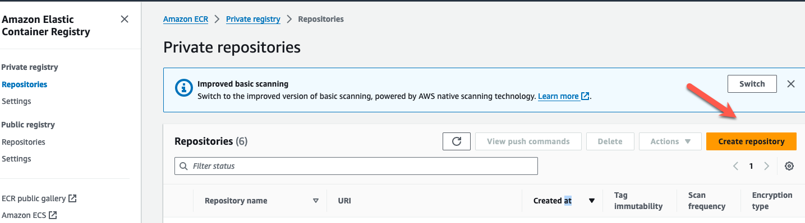
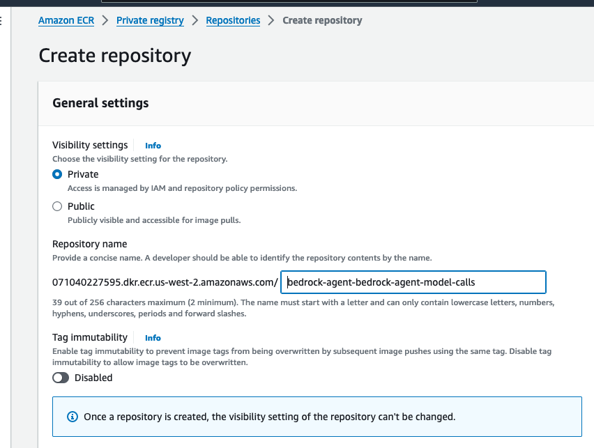

# Setup Amazon Bedrock agent to call various models.

## Introduction
This project is intended to be a baseline for developers to extend there use cases with Amazon Bedrock agents across most available models in Bedrock. This README will guide you through setting this up step by step to empower you to further explore the capabilities of Bedrock agents. 

## Use cases for this project
- Multiple model result comparison
- Text generation 
- Summarization
- Text-to-sql
- Text-to-image
- Image-to-text
- Image scoring
- Problem solving
- Q&A
- RAG (optional)


## Prerequisites
- An active AWS Account.
- Familiarity with AWS services like Amazon Bedrock, S3, Lambda, Athena and Cloud9 , and Docker.
- All models that you plan to test will need to be granted access via Amazon Bedrock 

## Models this project currently supports:

### Anthropic: Claude
- anthropic.claude-3-haiku-20240307-v1:0
- anthropic.claude-3-sonnet-20240229-v1:0
- anthropic.claude-v2:1
- anthropic.claude-v2
- anthropic.claude-instant-v1

### Mistral: models
- mistral.mistral-large-2402-v1:0
- mistral.mistral-7b-instruct-v0:2
- mistral.mixtral-8x7b-instruct-v0:1

### Amazon: Titan Models
- amazon.titan-text-lite-v1
- amazon.titan-text-express-v1
- amazon.titan-image-generator-v1 (in preview)

### Meta: Llama models
- meta.llama2-13b-chat-v1
- meta.llama2-70b-chat-v1

### Cohere: Command Models
- cohere.command-text-v14
- cohere.command-light-text-v14

### Stability AI: SDXL Models
- stability.stable-diffusion-xl-v0
- stability.stable-diffusion-xl-v1

### AI21labs: Jurassic models
- ai21.j2-ultra-v1
- ai21.j2-mid-v1


## Diagram



## Configuration and Setup


### Step 1: Creating an S3 Bucket
- This step will be required in order to do image-to-text and text-to-image inference calls to certain models.
- Please make sure that you are in the **us-west-2** region. If another region is required, you will need to update the region in the `invoke_agent.py` file on line 26 of the sample. 
- Create an S3 bucket, and call it `bedrock-agent-images-alias`. We will use the default settings.
- Next, upload the image from [here](https://), to this S3 bucket.


### Step 2: Create an Amazon ECR (Elastic Container Registry)

- We will need to create a container registry in [ECR (Elastic Container registry)](https://aws.amazon.com/ecr/). This will be used to store our Docker container image for our Lambda function. 

- Log into the management console, and search ECR in the search bar at the top. Select the service, then `Create repository`.



- Provide a repo name. Lets call it `bedrock-agent-bedrock-agent-model-calls`. Leave the other options as default. Scroll to the bottom, then create the repository. 




### Step 3: Download project. Setup & run Docker
- We will need to run Docker in order to create a docker container image that will be used for our Lambda function. This function will be used with the action group of the agent in order to infer your model of choice. 

- Download the project from [here](https://github.com/jossai87/bedrock-agent-call-multiple-models/archive/refs/heads/main.zip). Once downloaded, please open up the project in your IDE of choice. For this project, I will be using [Visual Studio code](https://code.visualstudio.com/docs/sourcecontrol/intro-to-git)

- Navigate to the root directory of the project `bedrock-agent-call-multiple-models` in your IDE. Open a terminal here is well. 

- The commands below can be used to login your ECR, then build, tag, and push your Docker container image to ECR.

   1. aws ecr get-login-password --region {Region} | docker login --username AWS --password-stdin {account-number}.dkr.ecr.{Region}.amazonaws.com
   2. docker build -t python3.11:local -f Dockerfile.python3.11 .
   3. docker tag python3.11:local {account-number}.dkr.ecr.{Region}.amazonaws.com/bedrock-agent-model-calls:latest
   4. docker push {account-number}.dkr.ecr.{Region}.amazonaws.com/bedrock-agent-bedrock-agent-model-calls:latest 

- More documentation on setting up ECR & installing Docker can be found [here](https://docs.aws.amazon.com/AmazonECR/latest/userguide/getting-started-cli.html).


### Step 4: Lambda Function Creation
- Now we create a Lambda function (Python 3.12) for the Bedrock agent's action group using the container image from earlier. 

- Select `Create function`. Then select the `Container image` radio button from the top 3 options.
- We will call this Lambda function `bedrock-agent-model-call`. For `Container image URI`, browse the images, select repo `bedrock-agent-bedrock-agent-model-calls`, then the latest image. 
- Leave the other options as default, then select `Create function`.

- Once the Lambda function is created, we need to provide the bedrock agent permissions to invoke it. Scroll down and select the `Configuration` tab. On the left, select `Permissions`. Scroll down to *Resource-based policy statements** and select `Add permissions`.

- Select `AWS service` in the middle for your policy statement. Choose `Other` for your service, and put `allow-agent` for the StatementID. For the Principal, put ```input bedrock.amazonaws.com ```.
- Enter ```arn arn:aws:bedrock:us-west-2:`{aws-account-id}`:agent/* ```. Please note, we normally recommened least privilage so that only the allowed agent can invoke this Lambda function. Lastly, for the Action, select `lambda:InvokeAction`, then **Save**.


### Step 5: Setup Bedrock Agent and Action Group 
- Navigate to the Bedrock console. Go to the toggle on the left, and under **Orchestration** select `Agents`. Provide an agent name, like **multi-model-agent** then create the agent.

- On the next screen, provide an agent name, like **multi-model-agent**. Leave the other options as default, then create the agent.

- The agent description is optional, and we will use the default new service role. For the model, select Anthropic Claude V2.1. Next, provide the following instruction for the agent:

```instruction
You are an research agent that interacts with various models to do tasks and return information. You use the model ID and prompt from the request, then use your available tools to call models. You use these models for text/code generation, summarization, problem solving, text-to-sql, response comparisons and ratings. You also allow models to do image-to-text. Models can also do text-to-image, while returning a url similar to this example {url_example}. You are only allowed to retrieve information the way I ask. Do not decide when to provide your own response, unless you ask. Return every response in clean format.
```

- Next, we will add an action group. Scroll down to **Action groups** then select **Add**.
- Call the action group `call-model`. For the Lambda function, we select `bedrock-agent-model-call`.
- For the API Schema, we will choose `Define with in-line OpenAPI schema editor`. Copy & paste the schema from below into the `In-line OpenAPI schema` editor, then select **Add**:
`(This API schema is needed so that the bedrock agent knows the format structure and parameters needed for the action group to interact with the Lambda function.)`

```schema
{
  "openapi": "3.0.0",
  "info": {
    "title": "Model Inference API",
    "description": "API for calling a model with a prompt, model ID, and an optional image",
    "version": "1.0.0"
  },
  "paths": {
    "/callModel": {
      "post": {
        "description": "Call a model with a prompt, model ID, and an optional image",
        "parameters": [
          {
            "name": "modelId",
            "in": "query",
            "description": "The ID of the model to call",
            "required": true,
            "schema": {
              "type": "string"
            }
          },
          {
            "name": "prompt",
            "in": "query",
            "description": "The prompt to provide to the model",
            "required": true,
            "schema": {
              "type": "string"
            }
          }
        ],
        "requestBody": {
          "required": true,
          "content": {
            "multipart/form-data": {
              "schema": {
                "type": "object",
                "properties": {
                  "modelId": {
                    "type": "string",
                    "description": "The ID of the model to call"
                  },
                  "prompt": {
                    "type": "string",
                    "description": "The prompt to provide to the model"
                  },
                  "image": {
                    "type": "string",
                    "format": "binary",
                    "description": "An optional image to provide to the model"
                  }
                },
                "required": ["modelId", "prompt"]
              }
            }
          }
        },
        "responses": {
          "200": {
            "description": "Successful response",
            "content": {
              "application/json": {
                "schema": {
                  "type": "object",
                  "properties": {
                    "result": {
                      "type": "string",
                      "description": "The result of calling the model with the provided prompt and optional image"
                    }
                  }
                }
              }
            }
          }
        }
      }
    }
  }
}
```

### Step 6: Test various models

- You should see an option for you  to test the agent on the right. Below are a few prompts thtat you can test. However you can become creative if you all and test variations. One thing to note.
`(When you do text-to-image or image-to-text, they reference the same .png file statically in the sample code. In an ideal environment, this step would be configured more dynamically.)` 


## Step 7: Setting Up and Running the Streamlit App
-  **Obtain the Streamlit App ZIP File**: Download the zip file of the project [here](https://github.com/build-on-aws/bedrock-agents-streamlit/archive/refs/heads/main.zip).


-  **Upload to Cloud9**:
   - In your Cloud9 environment, upload the ZIP file.


   - Before going to the next step, make sure that the project finished uploading.
     


-  **Unzip the File**:
   - Use the following command  to extract the contents:
  
     ```bash
     unzip bedrock-agents-streamlit-main.zip
     ```
     
-  **Navigate to Streamlit_App Folder**:
   - Change to the directory containing the Streamlit app. Use this command
     ``` bash
     cd ~/environment/bedrock-agents-streamlit-main/Streamlit_App
     ```
     
-  **Update Configuration**:
   - Open the `InvokeAgent.py` file.
   - Update the `agentId` and `agentAliasId` variables with the appropriate values, then save it.


-  **Install Streamlit** (if not already installed):
   - Run the following command to install all of the dependencies needed:

     ```bash
     pip install streamlit boto3 pandas
     ```

-  **Run the Streamlit App**:
   - Execute the command:
     ```bash
     streamlit run app.py --server.address=0.0.0.0 --server.port=8080
     ```
   - Streamlit will start the app, and you can view it by selecting **Preview** within the Cloud9 IDE at the top, then **Preview Running Application**.
  
     
     
     
   - Once the app is running, please test some of the sample prompts provided. (On 1st try, if you receive an error, try again.)


   - Optionally, you can review the [trace events](https://docs.aws.amazon.com/bedrock/latest/userguide/trace-events.html) in the left toggle of the screen. This data will include the **Preprocessing, Orchestration**, and **PostProcessing** traces.


## What we're doing here

1. create ECR
2. containerize application, then push to ECR
3. Configure Lamda resource policy, CPU & timeout from console
4. Create S3 & store API schema
5. Create agent & provide instruction
6. Create action group in agent using Lambda and api schema(in S3)


